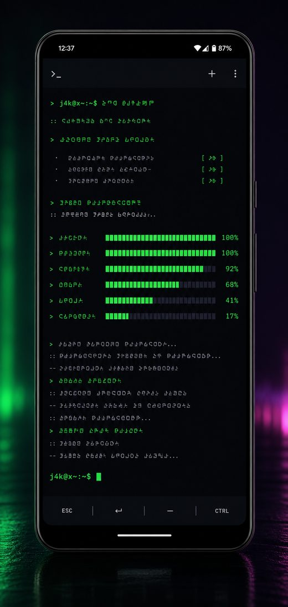
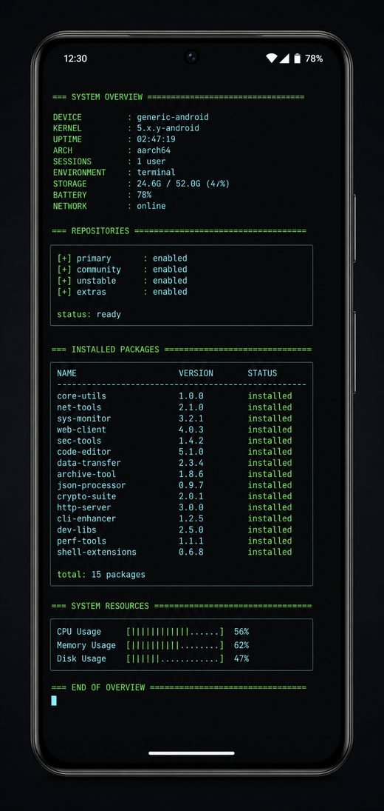
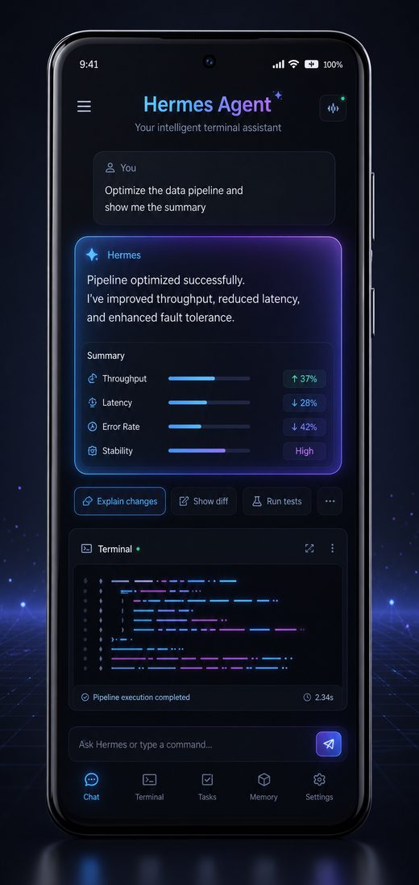
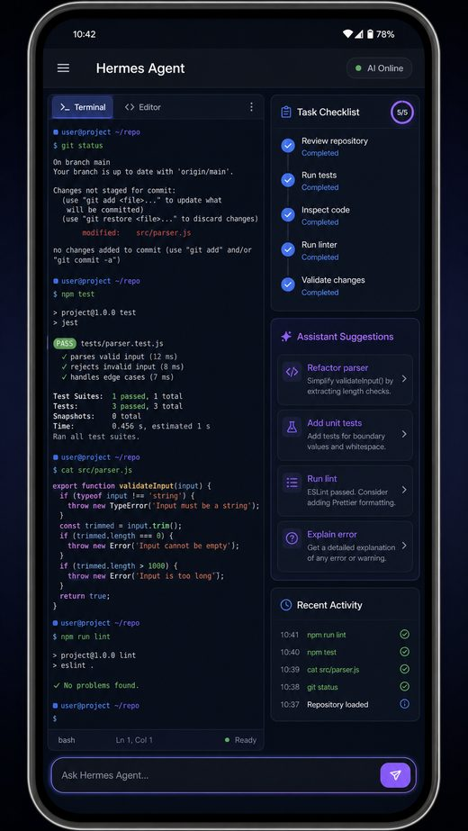
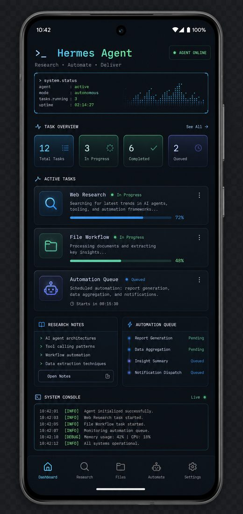
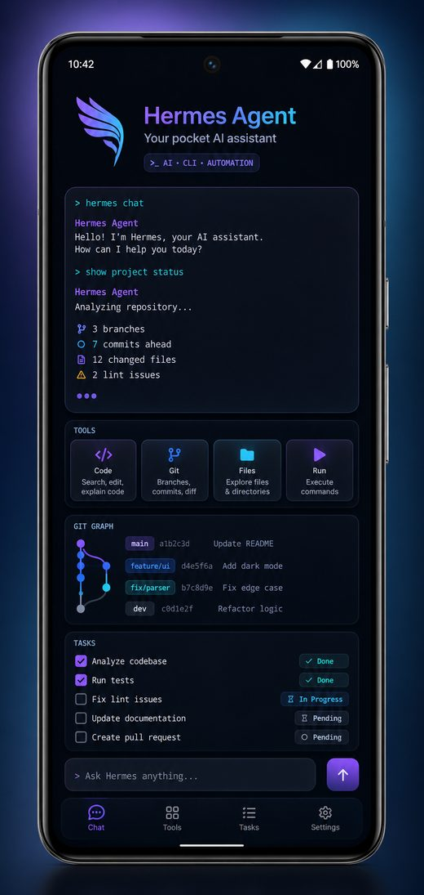

# Hermes Agent for Android using Termux

Install Hermes Agent on Android through Termux and turn your phone into a portable AI assistant environment.

Hermes Agent is a powerful terminal-based AI assistant from Nous Research. It can help with coding, research, writing, automation, system tasks, file operations, web-enabled workflows, and multi-step problem solving directly from your command line.

The general idea of this project is simple: prepare Android and Termux so Hermes Agent can run reliably on a phone, then install the official Hermes Agent in a clean, repeatable way.

Why this is useful:

- carry a capable AI assistant in your pocket;
- work from an Android phone without needing a laptop nearby;
- use a real terminal workflow with files, Git, scripts, and development tools;
- run longer tasks, local helpers, and command-line automations from Termux;
- keep the setup reproducible with a single public installer command.

This repository is not a fork of Hermes Agent. It is an Android/Termux bootstrap installer that prepares the environment and then runs the official Hermes Agent installer.


## Visual overview

<p align="center">
  
  
  
</p>

<p align="center">
  
  
  
</p>

## Compatibility

This installer is intended for modern Android devices running the F-Droid version of Termux.

It is not guaranteed to work on every device. Older Android versions, especially versions below Android 15, may fail because Hermes Agent and its dependencies require a compatible Python/runtime environment.

## 1. Install Termux

Install Termux App from F-Droid:

```text
https://f-droid.org/packages/com.termux/
```

Do not use the outdated Google Play build of Termux App.

Open Termux after installation and wait until the first-start setup finishes.

## 2. Update Termux packages

Run this inside Termux:

```sh
pkg update -y && pkg upgrade -y
```

If Android asks for confirmation during package upgrades, accept the default safe option unless you know you need something else.

## 3. Allow Android shared storage access

This step lets Termux access common shared folders such as Downloads, Documents, Pictures, DCIM, Movies, and Music.

Run:

```sh
termux-setup-storage
```

Approve the Android permission prompt when it appears.

Notes:

- this does not grant root access;
- this does not unlock other apps' private data;
- on modern Android, `/Android/data` and `/Android/obb` may remain restricted.

## 4. Keep Termux available in the background

Android may stop background apps to save battery. For better reliability, especially if you plan to use Hermes for long tasks, dashboards, servers, or scheduled jobs, adjust these settings before or after installation.

### Disable battery optimization for Termux

In Android settings, find Termux under app battery settings and set it to:

```text
Unrestricted
```

The exact menu name depends on the Android version and device vendor. Common paths are similar to:

```text
Settings -> Apps -> Termux -> Battery -> Unrestricted
```

or:

```text
Settings -> Battery -> Battery optimization -> Termux -> Don't optimize
```

Also avoid using "Force stop" on Termux if you expect background tasks to continue.

### Optional: keep the CPU awake

For long-running work, run:

```sh
termux-wake-lock
```

To release it later:

```sh
termux-wake-unlock
```

Wake lock can improve reliability but may use more battery.

### Optional: start Termux after phone reboot

Android does not automatically restart normal Termux sessions after a reboot. If you need startup automation, install Termux:Boot from F-Droid and configure a boot script manually.

Termux:Boot is optional and is not required for a normal Hermes installation.

## 5. Install Hermes Agent

Copy the full command into Termux:

```sh
pkg update -y && pkg install -y git && cd ~ && if [ -d Hermes-Agent-Android-Termux/.git ]; then cd Hermes-Agent-Android-Termux && git pull --ff-only; else git clone https://github.com/IceHeartGitH/Hermes-Agent-Android-Termux.git && cd Hermes-Agent-Android-Termux; fi && bash install.sh --force
```

Important installation notes:

- the installation can take 15 to 30 minutes, and sometimes longer, depending on the phone, CPU, storage speed, network speed, and whether native packages need to build;
- if there is no clear error on the screen, do not interrupt the installation just because it looks slow;
- if the installation continues for more than 45 to 60 minutes with no progress, stop it manually with `Ctrl+C`, then run the same install command again;
- start with at least 50% battery, or keep the phone connected to power during installation;
- increase the screen timeout before starting, if your phone allows it;
- if the phone does not allow a long screen timeout, keep the screen active manually while installation is running.

What this command does:

1. installs Git if needed;
2. clones or updates this public installer repository;
3. runs `install.sh` from the local checkout;
4. prepares a Hermes-compatible Termux environment;
5. downloads and runs the official Hermes Agent installer;
6. creates the `hermes` command.

This command only clones or updates this public installer repository. It does not include credentials, sessions, logs, or device-specific files.

## 6. Verify the installation

Run:

```sh
hermes --version
bash verify.sh
```

Optional health check:

```sh
hermes doctor
```

If verification fails, see the Troubleshooting section below.

## 7. Run Hermes setup

Configure your model/provider:

```sh
hermes setup
```

Follow the interactive prompts.

## 8. Start Hermes

Start the interactive CLI:

```sh
hermes
```

Useful commands after setup:

```sh
hermes --version
hermes doctor
hermes model
hermes tools
```

## 9. Update Hermes Agent

After a successful installation, update Hermes Agent with:

```sh
hermes update
```

To update this Android/Termux installer repository itself, rerun the install command from section 5. It will fast-forward the local checkout before running `install.sh`.

## 10. Troubleshooting

If installation fails:

1. Make sure Termux is installed from F-Droid.
2. Run `pkg update -y && pkg upgrade -y` and try again.
3. Check the Android version. Older Android versions may not support the Python runtime required by Hermes Agent.
4. Run `bash verify.sh` and include the output when opening an issue.

If storage access does not work, run again:

```sh
termux-setup-storage
```

Then approve the Android permission prompt.

If background work stops unexpectedly:

1. set Termux battery usage to `Unrestricted`;
2. avoid force-stopping Termux;
3. run `termux-wake-lock` while long-running work is needed;
4. reopen Termux after phone reboot.

## 11. Uninstall Hermes Agent

To remove the Hermes runtime/data directory created by this installer and the `hermes` launcher, run:

```sh
bash scripts/uninstall-hermes-android-termux.sh --yes
```

This removes:

```text
$PREFIX/bin/hermes
~/.hermes-venv
~/.config/hermes-agent-termux
~/.local/share/hermes-agent-termux
```

It does not uninstall the Termux App itself.

## 12. Reset to a clean Termux-only state

Use this if you want to remove Hermes Agent and this installer checkout, leaving the phone with Termux installed but without this Hermes setup.

Recommended reset:

```sh
cd ~/Hermes-Agent-Android-Termux
bash scripts/reset-termux-clean.sh --yes
```

This removes:

```text
$PREFIX/bin/hermes
~/.hermes-venv
~/.config/hermes-agent-termux
~/.local/share/hermes-agent-termux
~/Hermes-Agent-Android-Termux
```

It keeps Termux packages such as Git, Python, Node.js, Rust, and build tools, because those packages may also be used for other work.

### Optional package cleanup

If you want Termux to be closer to a fresh app state and you do not need the packages installed for Hermes, run:

```sh
cd ~/Hermes-Agent-Android-Termux
bash scripts/reset-termux-clean.sh --yes --purge-packages
```

This also tries to remove common packages installed for Hermes, then runs:

```sh
pkg autoremove -y
```

It does not remove:

- the Termux App;
- Android shared storage permission already granted to Termux;
- unrelated files you created manually;
- GitHub/model/provider credentials stored outside the paths listed above.

To fully remove Termux from the phone, uninstall the Termux App from Android settings.

## What this repository does not include

- credentials or tokens;
- auth files;
- sessions, logs, or state databases;
- device-specific notes;
- unrelated project workflows.

## License

MIT
